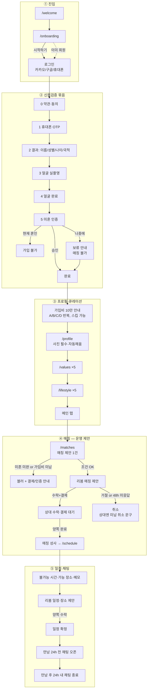
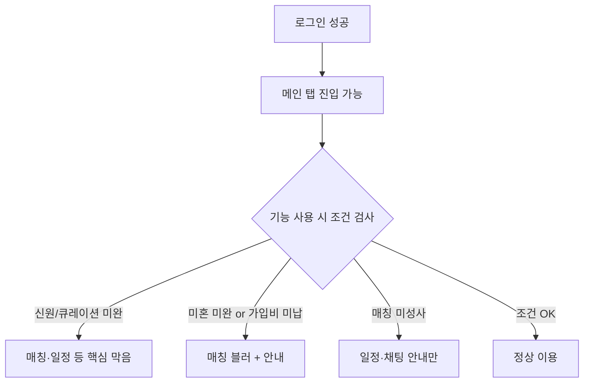
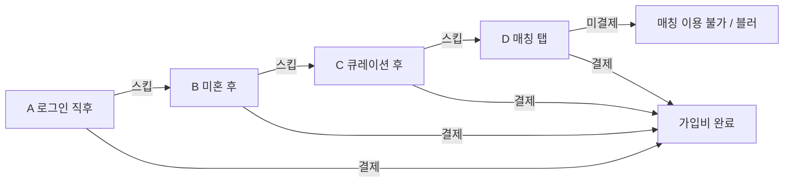
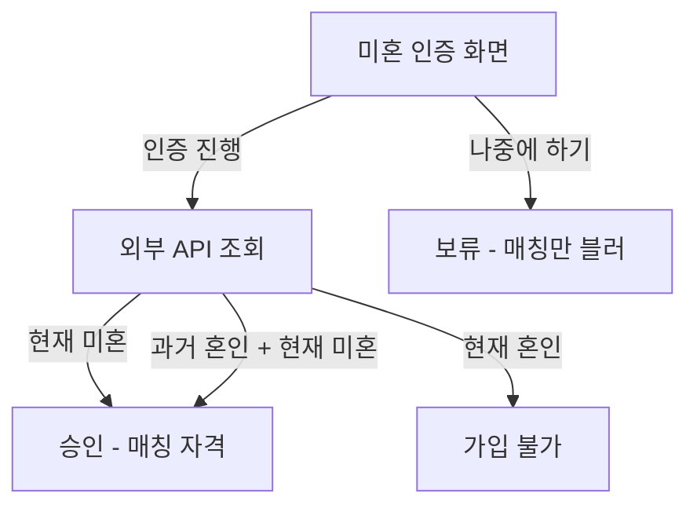
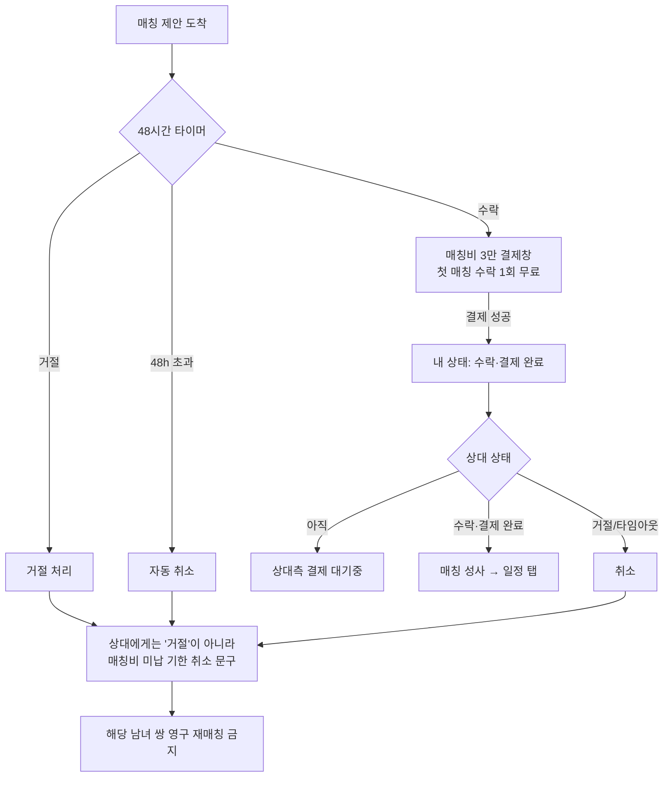
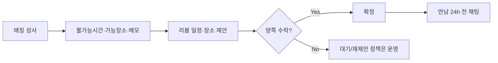
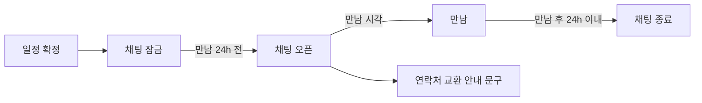
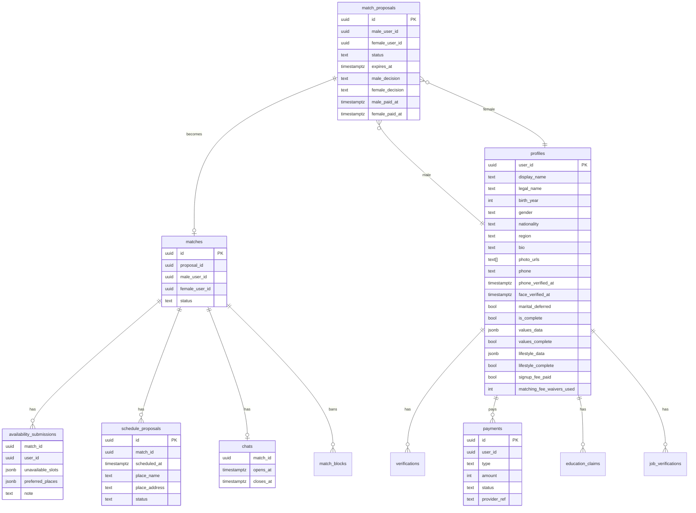

# 리봄 앱 — 개발자용 플로우차트 / 프레임워크

> **이 문서만 보고 앱을 구현할 수 있게** 쓴 제품 스펙입니다.  
> GitHub에서 Mermaid 다이어그램이 그림으로 렌더링됩니다.

| 항목 | 내용 |
|------|------|
| 범위 | 앱 (+ 운영 Admin). 랜딩·사전예약 웹은 별도 |
| 기준 | 제품 오너 인터뷰로 확정한 **목표 프레임워크** (구 MVP 코드와 다를 수 있음) |
| 제외 | 와이어프레임·시각 디자인 (프레임워크 확정 후 별도) |
| 버전 | 2026-07-11 |

### 목차

1. [한 줄 요약](#0-한-줄-요약)
2. [전체 마스터 플로우](#1-전체-마스터-플로우)
3. [접근 제어·가입비](#2-접근-제어-게이트--강제-리다이렉트-없음)
4. [화면별 상세](#3-화면별-상세-스펙)
5. [매칭·일정·채팅](#4-메인-탭)
6. [결제](#5-결제)
7. [알림](#6-알림-목록-필수)
8. [운영 Admin](#7-운영자admin-화면--이번-범위-포함)
9. [DB](#8-db-모델-논리)
10. [API](#9-api-목록-논리)
11. [예외](#10-예외엣지)
12. [실연동 범위](#11-이번-범위에서-실제-연동할-것)
13. [구 MVP 차이](#12-기존-mvp-코드와의-차이-이주-시-참고)
14. [체크리스트](#13-화면기능-체크리스트)
15. [미확정](#14-미확정-개발자-선정-후-문서에-기입)

---

## 0. 한 줄 요약

```
웰컴 → 온보딩
  → 로그인(카카오/구글/휴대폰)
  → 신원검증(동의→휴대폰OTP→얼굴→미혼 또는 보류)  ※ OTP 시 이름·성별·나이·국적 확보
  → 가입비 10만 안내(스킵 가능, 매칭 직전/매칭에서 미결제면 매칭 불가)
  → 프로필(사진 필수, 성별·나이 자동채움, 수도권 지역)
  → 가치관(5) → 라이프(5)
  → [운영] 리봄이 남·녀 1쌍 매칭 제안 (유저당 2일 주기 1건)
  → 양쪽 48시간 내 수락 + 매칭비 3만(첫 매칭 수락 1회 무료)
  → 불가능 시간·가능 장소·메모 제출 (앞으로 10일 창)
  → [운영] 일정·장소 제안 → 양쪽 수락(추가 결제 없음)
  → 만남 24시간 전 채팅 오픈 → 만남 후 24시간 내 채팅 종료(연락처 교환 안내)
```

**하단 탭:** 매칭 · 일정 · 프로필(내 정보)

**없는 것:** 유저 간 자유 관심/맞관심 매칭, 스와이프, 휴대폰 번호 공개, 동성 매칭

---

## 1. 전체 마스터 플로우



---

## 2. 접근 제어 (게이트) — 강제 리다이렉트 없음

로그인 후 **미완료 단계로 강제로 밀어 넣지 않는다.**  
메인은 들어가되, **조건 미충족 시 해당 기능만 막는다.**



| 조건 미충족 | 막히는 것 | UI |
|-------------|-----------|-----|
| 신원검증(동의~얼굴) 미완 | 매칭·일정 등 핵심 | 해당 탭에서 인증 유도 |
| 미혼 미승인(보류 포함) | 매칭(타인 신상) | 매칭 화면 **블러** + 인증 안내 |
| 가입비 미결제 | 매칭(타인 신상) | 매칭 화면 **블러** + 결제 안내 |
| 프로필·가치관·라이프 미완 | 매칭·일정 등 핵심 | 탭은 보이되 핵심 기능 막음 |
| 매칭 미성사 | 일정 조율·채팅 | 일정 탭 빈 상태/안내 |

**공개 경로 (비로그인):** `/welcome`, `/onboarding`, 로그인 관련 경로  
**로그아웃:** `/my`에서만

### 가입비 10만 — 노출 시점 (스킵 가능, 최종 하드 게이트는 매칭)



| 시점 | 코드 | 동작 |
|------|------|------|
| 회원가입/로그인 직후 | A | 결제 안내 1회 |
| 미혼 인증(또는 보류) 직후 | B | 미결제면 다시 안내 |
| 프로필·가치관·라이프 완료 직후 | C | 미결제면 다시 안내 |
| 매칭 탭 진입 | D | 미결제면 다시 안내. **여기서도 안 내면 매칭 이용 불가** |

미결제여도 온보딩·신원·프로필·가치관·라이프·내 정보까지는 진행 가능.  
**매칭 화면에서 다른 유료 유저 신상을 볼 수 없음** (블러).

---

## 3. 화면별 상세 스펙

### 3-1. `/welcome`

| 항목 | 내용 |
|------|------|
| 역할 | 앱 첫 진입 |
| CTA | 시작 → `/onboarding` |
| 로그인 | 불필요 |

### 3-2. `/onboarding`

| 항목 | 내용 |
|------|------|
| 역할 | 제품 소개 슬라이드 |
| CTA | 시작하기 → 로그인 |
| 링크 | 이미 회원 → 로그인 |

### 3-3. 로그인 / 계정

| 방식 | 비고 |
|------|------|
| 카카오 소셜 | 이번 범위 **실연동** |
| 구글 소셜 | 이번 범위 **실연동** |
| 휴대폰 번호 로그인 | 이번 범위 **실연동** (OTP) |

이메일·비밀번호 단독 가입은 **필수 아님** (소셜·휴대폰이 본계정).  
구현 시 Auth 제공자: Supabase Auth + 각 프로바이더 설정.

---

### 3-4. 신원검증 (`/signup/verify` 등) — 동의~완료 한 묶음

앱 설치 후 초기에 진행. **동의 → 휴대폰 OTP → 결과 → 얼굴 → 미혼(또는 나중에) → 완료**.

#### STEP 0 — 동의

| id | 필수 | 라벨 |
|----|------|------|
| `terms` | ✅ | 이용약관 |
| `privacy` | ✅ | 개인정보 수집·이용 |
| `third-party` | ✅ | 제3자 제공 |
| `age` | ✅ | 만 50세 이상 |
| `marketing` | ❌ | SMS 마케팅 |

필수 전부 체크 시 CTA 활성 → 휴대폰 단계.

#### STEP 1 — 휴대폰 OTP (**실인증**)

| 항목 | 규칙 |
|------|------|
| 입력 | 휴대폰 번호 |
| 검증 | **실제 SMS 인증번호** |
| OTP 성공 시 확보 데이터 | **이름, 성별, 나이, 국적** → 프로필에 저장·이후 자동채움 |

#### STEP 2 — 휴대폰 결과

확보한 이름·성별·나이·국적 **실데이터 표시** (하드코딩 MOCK 결과 화면 금지 — 실연동 기준).

#### STEP 3~4 — 얼굴 (**실촬영·본인확인**)

실제 카메라 촬영 및 본인 확인 필요. 통과 시 `face_verified_at` 저장.

#### STEP 5 — 미혼 인증



| 선택 | 결과 |
|------|------|
| 미혼 인증 진행 | 외부 API(예: Codef 가족관계)로 **현재 미혼** 확인 |
| 승인 | 매칭 자격 충족(다른 조건과 AND) |
| **현재 혼인** | **가입 불가** (서비스 이용 차단) |
| 과거 혼인 + **현재 미혼 증명** | 가입·이용 가능 |
| **나중에 하기** | 프로필·큐레이션까지 가능, **매칭은 블러/불가** |

입력 예: 실명, 생년월일 등 API 요구 필드.  
DB: `verifications` (`type=marital`, `status=approved|rejected`, raw, `verified_at`).  
보류: `profiles.marital_deferred=true`.

#### STEP 완료

| 상태 | 의미 |
|------|------|
| 미혼 포함 완료 | 신원 풀세트 |
| 미혼 보류 완료 | 매칭만 잠금 |

---

### 3-5. `/profile` — 기본 프로필

| 필드 | 필수 | 규칙 |
|------|------|------|
| 사진 | ✅ | 필수 (jpeg/png/webp 등). 최대 장수는 구현 시 기존 3장 상한 유지 권장 |
| 닉네임 | ✅ | |
| 성별 | ✅ | **OTP 데이터 자동채움** (수정 정책: 기본 잠금 권장, 오만 시 고객지원) |
| 출생연도/나이 | ✅ | **OTP 데이터 자동채움** |
| 지역 | ✅ | **수도권만** — 서울, 경기, 인천 등 |
| 자기소개 | ❌ | bio |
| 이름 등 | — | OTP에서 확보, 매칭 노출 정책은 닉네임 중심(실명 노출 여부는 운영 정책으로 분리 가능) |

완료 시 `is_complete=true` → `/values`.

---

### 3-6. `/values` — 가치관 5단계

각 단계 **최소 1개** 칩 (피하고 싶은 것은 빈값 허용 가능 — 기존 UX 유지 권장).

| 단계 | 키 | 칩(현행) |
|------|-----|----------|
| Q1 | `meeting_priorities` | 진솔한 대화 / 서로 존중 / 천천히 알아가기 / 가족·인연 중시 / 함께 성장 |
| Q2 | `relationship_goals` | 결혼이 목표에요 / 진지한 만남 / 친구같은 만남 / 상황에 따라 / 반드시 결혼은 아님 / 가벼운 관계는 싫어요 |
| Q3 | `politics` | 보수 / 진보 / 중도·실용 / 관심 없어요 / 대화 시 존중 |
| Q4 | `religion` | 기독교 / 천주교 / 불교 / 무교 / 관심 없어요 / 대화 시 존중 |
| Q5 | `avoid_filters` | 과한 음주 / 흡연 / 운동 부족 / 대머리 / 과체중 / 과한 탈모 / 결혼이 목적인 사람 |

저장: `profiles.values_data`, `values_complete=true` → `/lifestyle`.  
`/my`에서 **수정 가능**.

---

### 3-7. `/lifestyle` — 라이프스타일

| 단계 | 키 | 칩(현행) |
|------|-----|----------|
| 활동 | `activities` | 산책·등산 / 요리·맛집 / 여행 / 독서·영화 / 음악·공연 |
| 가족 | `family` | 자녀 없음 / 자녀와 동거 / 자녀 독립 / 반려동물 / 부모님과 동거 |
| 자기관리 | `self_care` | 헬스 / 요가·필라테스 / 독서 / 외국어 / 투자 / 산책·러닝 |
| 음주 | `drinking` | 안 마셔요 / 가끔 / 주1~2 / 주3~4 / 거의 매일 |
| 흡연 | `smoking` | 안 해요 / 가끔 / 반갑 이하 / 1갑 / 1갑 이상 |

음주·흡연 화면은 **둘 다** 1개 이상.  
저장: `profiles.lifestyle_data`, `lifestyle_complete=true` → 메인.  
`/my`에서 **수정 가능**.

---

## 4. 메인 탭

하단: **매칭** `/matches` · **일정** `/schedule` · **프로필** `/my`

---

### 4-1. `/matches` — 매칭 제안 (유저 관심 매칭 아님)

**모델:** 리봄 운영자가 **남·녀 한 쌍**을 골라 양쪽에게 **매칭 제안**을 보낸다.  
유저가 자유롭게 여러 명을 브라우징하지 않는다.

| 규칙 | 내용 |
|------|------|
| 노출 | **한 번에 1명(1건 제안)** |
| 주기 | **2일에 한 번** 다른 사람/건으로 갱신 (운영이 새 제안) |
| 진입 | 알림 “매칭 제안” → 탭/딥링크로 상대 프로필 |
| 미혼 미완·가입비 미납 | **블러** + 결제/인증 CTA |
| 동성 | **없음** (항상 남녀) |

#### 제안 후보가 되려면 (양쪽 모두)

- 수도권 지역
- 미혼 `approved`
- 가입비 결제 완료
- 프로필·가치관·라이프 완료
- 이미 매칭 중인 상대 제외
- 과거 **거절/미납 취소**로 끝난 쌍 **영구 재매칭 금지**
- 가치관·라이프 **유사도**를 운영 선정·정렬 보조에 사용 (자동 완전 대체 아님 — 최종 짝 짓기는 운영)

#### 수락 / 거절 / 48시간



| 항목 | 규칙 |
|------|------|
| 매칭비 | **3만원**, **양쪽 모두**, **매칭 제안 수락 시** 결제창 → 성공해야 수락 확정 |
| 첫 1회 무료 | 유저당 **첫 매칭 제안 수락(결제 시점) 1회** 매칭비 면제 |
| 한쪽만 완료 | 일정/상태는 **「상대측 결제 대기중」** |
| 거절 | 상대에게 “거절당함” 알림 **없음**. **「상대방이 매칭비용(3만원)을 기한 내에 내지 않아 취소되었습니다」** |
| 48시간 | 결제·수락 없으면 **자동 취소** (동일 미납 취소 문구 정책) |
| 성사 후 | **일정 탭**으로 흐름 이동. 매칭 탭은 계속 “제안/추천” 용도 |

> 구 MVP의 `interests` 맞관심 자동 매칭은 **본 프레임워크에서 사용하지 않음**.

---

### 4-2. `/schedule` — 일정 조율

매칭 성사 후에만 본격 사용.

#### ① 유저 입력 (양쪽)

| 항목 | 필수 | 규칙 |
|------|------|------|
| 불가능 시간 | ✅ | **가능 시간을 고르는 것이 아님**. 앞으로 **10일 이내 일정 창** 안에서 **불가능한 시간**을 선택 |
| 가능 장소 | ✅ | 만날 수 있는 장소 후보 |
| 참고 메모 | ❌ | 리봄에 알리고 싶은 말 |

> “10일” = **제출 기한이 아니라**, 조율 대상이 되는 **날짜 범위(윈도우)**.

#### ② 리봄 운영 제안

유저 불가능 시간·가능 장소·메모를 보고 **최적 일정(날짜·시간) + 장소** 제안.

제안 필수 필드: **날짜, 시간, 장소**.

#### ③ 수락

| 항목 | 규칙 |
|------|------|
| 추가 결제 | **없음** (매칭비는 매칭 수락 시에만) |
| 양쪽 수락 | `confirmed` |
| 한쪽만 | 상대 수락 대기 |



#### 연락처

- **휴대폰 번호 상호 공개 없음**
- 채팅에서 만나기 전 소통 + 만남 시 교환 안내

---

### 4-3. 채팅



| 항목 | 규칙 |
|------|------|
| 오픈 | 만남 일시 기준 **24시간 전** |
| 종료 | 만남 이후 **24시간 이내 닫힘** |
| 안내 | 만남에서 **연락처 교환**하라는 문구 표시 |
| 그 전 | 채팅 **불가** |
| 범위 | 텍스트 중심 (이미지 등은 1차에서 텍스트만으로 명시 가능 — 확장 시 별도) |

알림: `채팅 오픈`.  
**휴대폰 번호는 앱에서 서로 공개하지 않음.**

---

### 4-4. `/my` — 내 정보

| 기능 | 상세 |
|------|------|
| 프로필 보기/수정 | 사진·닉네임·지역·bio 등 (자동채움 성별·나이는 정책에 따라 잠금) |
| 가치관·라이프 수정 | `/values`, `/lifestyle` 재진입 |
| 미혼 인증하기 | **필수 경로 제공** (보류자·미완료자) |
| 학력 인증 | 아래 4-4-1 |
| 직업/소득 인증 | 아래 4-4-2 |
| 결제 내역 | 가입비·매칭비 이력 |
| 로그아웃 | |

#### 4-4-1. 학력 인증

| 항목 | 규칙 |
|------|------|
| 필수 선택 | 초졸 / 중졸 / 고졸 / 대졸 중 택1 |
| 선택 입력 | 학교 이름 직접 기입 (옵션) |
| 고지 | **허위 기재 시 법적 책임은 본인** 문구 **명시 필수** |
| 뱃지 | 선택 입력 수준(실서류 검증 없음). UI에 학력 표시·뱃지 정책은 운영 확정 |

#### 4-4-2. 직업/소득 인증

| 항목 | 규칙 |
|------|------|
| 제출물 | ① 재산세 납부 사진/캡처 ② 직장 급여 내역서 ③ 전 직장 급여 내역서 중 업로드(요구 조합은 운영 검수 기준) |
| 심사 | **운영진 수동 심사** 후 뱃지 부여 |
| 금지 | 주민등록번호 **뒷자리 노출 절대 금지** (클라이언트 안내 + 가능하면 업로드 검수/마스킹 가이드) |
| 상태 | `pending` / `approved` / `rejected` |

---

## 5. 결제

| 상품 | 금액 | 시점 | 누가 |
|------|------|------|------|
| 가입비 | 100,000원 | A→B→C→D 안내, 매칭 이용 전 필수 | 본인 |
| 매칭비 | 30,000원 | **매칭 제안 수락 시** (일정 수락 시 추가 없음) | **양쪽** |
| 매칭비 면제 | 0원 | 유저당 **첫 매칭 수락 1회** | 해당 유저만 |

- **실제 결제** 연동 (테스트 모드 → 라이브).
- PG: **미정 → 개발자 추천**. 국내 카드·간편결제 기준 **포트원(토스·카카오페이 등 채널) 또는 토스페이먼츠** 권장. 확정 후 `.env`에 키 문서화.
- 웹훅으로 `payments` 상태 확정. 클라이언트만 믿고 매칭 성사 처리 금지.

---

## 6. 알림 목록 (필수)

| 이벤트 | 수신자 |
|--------|--------|
| 매칭 제안 | 양쪽 |
| 일정 제안 | 양쪽 |
| 상대 결제 대기 | 수락·결제한 쪽 |
| 확정 (매칭 성사 / 일정 확정) | 양쪽 |
| 채팅 오픈 | 양쪽 |
| 취소 (미납·거절·48h·운영) | 정책상 노출되는 쪽 (거절 사실 직접 통지 없음, 미납 취소 문구) |

푸시(APNs/FCM) + 인앱. 채널 세부은 구현 시.

---

## 7. 운영자(Admin) 화면 — 이번 범위 포함

| 기능 | 설명 |
|------|------|
| 회원 목록 | 프로필·인증(휴대폰/얼굴/미혼)·가입비·큐레이션 완료 여부 |
| 매칭 제안 생성 | 남 1 + 여 1 선택 → 양쪽에게 제안 발송, 48h 타이머 |
| 유사도 보조 | 가치관·라이프 유사 후보 추천 리스트 (최종 선택은 운영) |
| 일정 조율 | 양쪽 불가능 시간·가능 장소·메모 조회 → 날짜·시간·장소 제안 |
| 학력 | 선택값·학교명 확인 |
| 직업 서류 | 업로드 검토, 주민번호 뒷자리 있으면 **반려**, 승인 시 뱃지 |
| 결제·취소 | 가입비/매칭비 상태, 대기중·환불 정책은 별도 명시 |

Admin 인증: 내부 계정 + RLS/서비스롤 분리.

---

## 8. DB 모델 (논리)



| `payments.type` | `signup_fee` \| `matching_fee` |
| `match_proposals.status` | `pending` \| `waiting_other_payment` \| `accepted` \| `cancelled` |
| decision | `pending` \| `accepted` \| `rejected` \| `expired` |
| `match_blocks` | 거절/미납 취소된 남녀 쌍 — **영구 재매칭 금지** |

---

## 9. API 목록 (논리)

| Method | Path | 용도 |
|--------|------|------|
| POST | `/api/auth/*` | 소셜·휴대폰 (BaaS 위임 가능) |
| POST | `/api/verification/phone` | OTP 요청/확인, 신상 저장 |
| POST | `/api/verification/face` | 얼굴 검증 완료 처리 |
| POST | `/api/verification/marital` | 미혼 인증 |
| POST | `/api/payments/signup` | 가입비 결제 세션 |
| POST | `/api/payments/matching` | 매칭비 결제 세션 |
| POST | `/api/payments/webhook` | PG 웹훅 |
| GET | `/api/match-proposals/current` | 내 현재 제안 1건 |
| POST | `/api/match-proposals/[id]/accept` | 수락(결제 선행) |
| POST | `/api/match-proposals/[id]/reject` | 거절 |
| POST | `/api/matches/[id]/availability` | 불가능 시간·장소·메모 |
| POST | `/api/admin/match-proposals` | 운영: 제안 생성 |
| POST | `/api/admin/schedule-proposals` | 운영: 일정 제안 |
| POST | `/api/schedule-proposals/[id]/accept` | 유저 일정 수락 |
| GET | `/api/chats/[matchId]` | 채팅 윈도우·메시지 |
| POST | `/api/chats/[matchId]/messages` | 메시지 전송 (오픈~종료만) |
| POST | `/api/my/education` | 학력 저장 |
| POST | `/api/my/job-verification` | 직업 서류 업로드 |
| POST | `/api/admin/job-verification/[id]` | 심사 |

경로명은 구현 시 프로젝트 컨벤션에 맞게 조정 가능. **동작·규칙이 스펙**.

---

## 10. 예외·엣지

| 상황 | 동작 |
|------|------|
| 현재 혼인 | 가입·서비스 불가 |
| 미혼 나중에 | 매칭 블러 |
| 가입비 미납 | 매칭 블러, 그 외 진행 가능 |
| 매칭 한쪽만 결제 | 상대측 결제 대기중 |
| 거절 | 상대엔 미납 취소 문구, 쌍 영구 블록 |
| 48h 미응답 | 자동 취소, 동일 |
| 일정 창 | 오늘부터 10일 이내 슬롯만 |
| 채팅 윈도우 밖 | 송수신 거부 |
| 주민번호 뒷자리 서류 | 직업 인증 반려 |
| 학력 허위 | 고지된 본인 책임 |

---

## 11. 이번 범위에서 **실제 연동**할 것

| 항목 | 상태 |
|------|------|
| 카카오·구글·휴대폰 로그인 | 실연동 |
| SMS OTP + 신상(이름·성별·나이·국적) | 실연동 |
| 얼굴 실촬영·본인확인 | 실연동 (벤더 선정 필요) |
| 미혼(Codef 등) | 실연동 |
| 가입비·매칭비 결제 | 실연동 (PG 개발자 추천 후 확정) |
| 운영 Admin (짝짓기·일정·심사) | 포함 |
| 채팅 (시간창) | 포함 |
| 푸시 알림 | 포함 |

---

## 12. 기존 MVP 코드와의 차이 (이주 시 참고)

| 구 MVP | 본 프레임워크 |
|--------|----------------|
| 이메일 가입 중심 | 카카오/구글/휴대폰 |
| 미들웨어로 단계 강제 리다이렉트 | 강제 없음, 기능 게이트 |
| 휴대폰·얼굴 MOCK | 실연동 |
| 하루 1명 `daily_recommendations` + 관심/맞관심 | **운영 매칭 제안**, 2일 1건, 관심 테이블 폐기 |
| 일정 유저 직접 제안 중심 | 불가능 시간 수집 → **운영 제안** |
| 채팅 없음 | 만남 ±24h ~ 만남 후 24h |
| 결제 없음 | 가입비 10만 + 매칭비 3만 |
| 학력·직업 UI만 | 학력 선택+고지, 직업 서류 심사 |

---

## 13. 화면·기능 체크리스트

- [ ] `/welcome`, `/onboarding`
- [ ] 로그인 (카카오/구글/휴대폰)
- [ ] 신원검증 0~완료 (OTP 신상, 얼굴, 미혼/보류/현재혼인차단)
- [ ] 가입비 A/B/C/D + 매칭 하드 게이트
- [ ] `/profile` (사진 필수, 자동채움, 수도권)
- [ ] `/values`, `/lifestyle` + `/my` 수정
- [ ] `/matches` 제안 1건·블러·48h·결제·대기·취소 문구
- [ ] `/schedule` 불가능시간·장소·운영제안·수락
- [ ] 채팅 시간창 + 연락처 교환 안내
- [ ] `/my` 결제내역·학력·직업업로드·로그아웃
- [ ] Admin 전체
- [ ] 알림 6종

---

## 14. 미확정 (개발자 선정 후 문서에 기입)

1. **PG** — 포트원 / 토스페이먼츠 등  
2. **얼굴 본인확인 벤더**  
3. **휴대폰 본인인증·OTP 벤더** (패스/다날/KG 등) — 이름·성별·나이·국적 회수 가능해야 함  
4. 채팅 인프라 (Supabase Realtime vs 전용)

---

문의: primesenior0530@gmail.com

**문서 버전:** 제품 인터뷰 재작성본 (2026-07-11)
