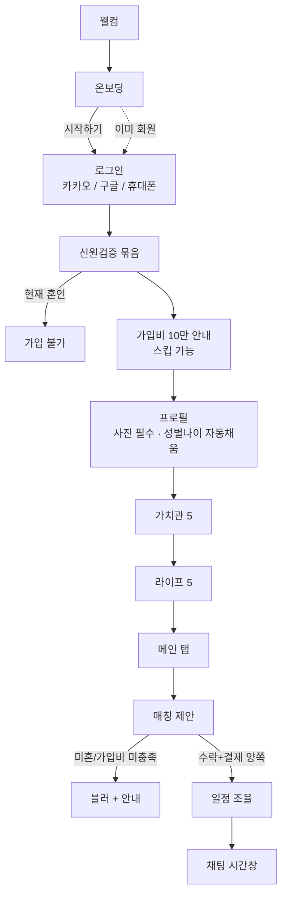
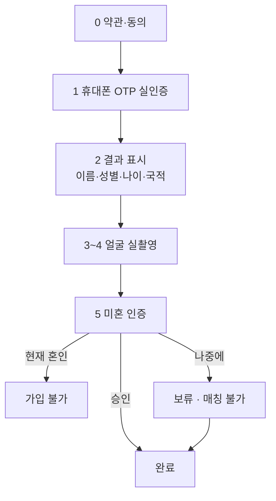
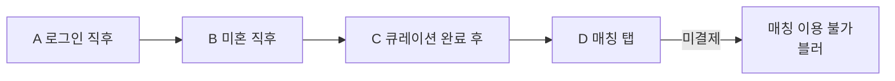
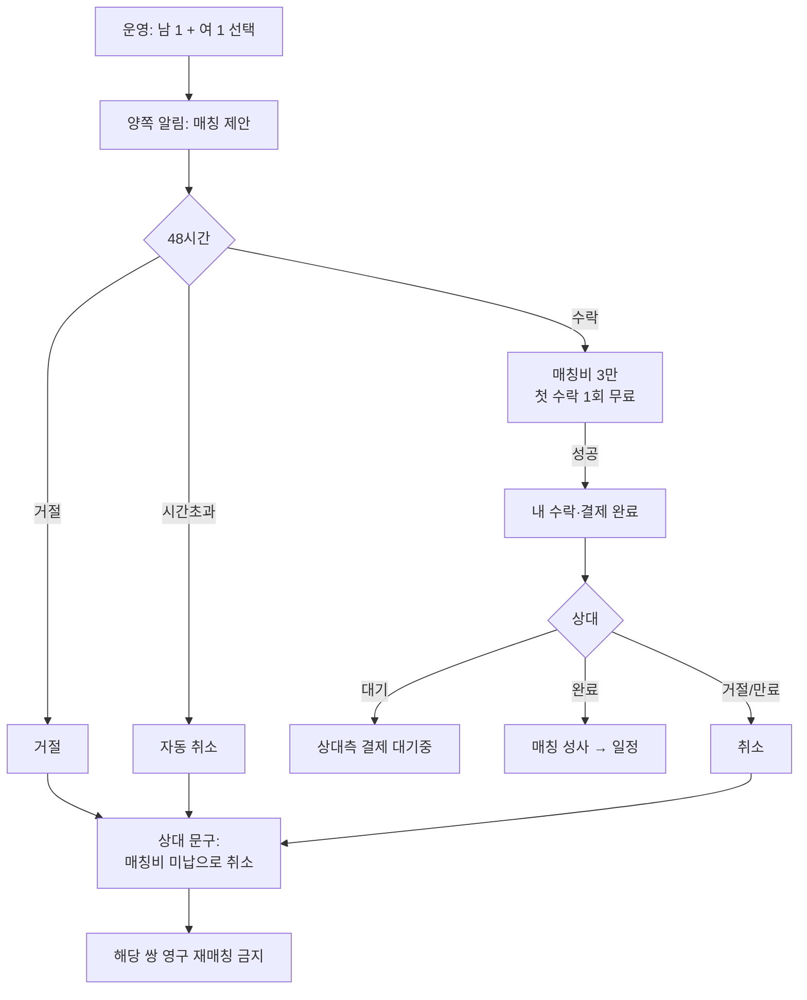
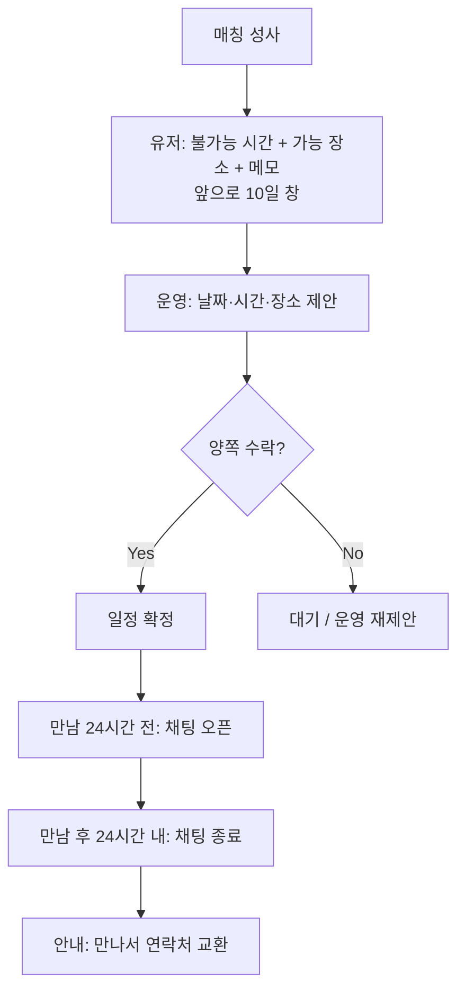
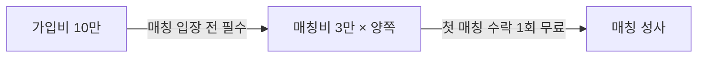

# 리봄 앱 — 플로우차트 (GitHub용)

> 개발자는 **이 문서 + [FRAMEWORK.md](./FRAMEWORK.md)** 만 보고 구현합니다.  
> GitHub에서 아래 Mermaid 그림이 바로 렌더링됩니다.  
> 와이어프레임·UI 시안은 **프레임워크 확정 후** 별도.

| | |
|--|--|
| 범위 | 유저 앱 + 운영 Admin (랜딩·사전예약 웹 제외) |
| 버전 | 2026-07-11 (제품 인터뷰 확정본) |
| 상세 스펙 | [FRAMEWORK.md](./FRAMEWORK.md) (화면·DB·API·예외 전부) |

---

## 한 줄 요약

```text
웰컴 → 온보딩 → 로그인(카카오/구글/휴대폰)
  → 신원검증(동의 → OTP → 얼굴 → 미혼/보류)
  → 가입비 10만 안내(스킵 가능 → 매칭에서 미납이면 차단)
  → 프로필 → 가치관(5) → 라이프(5)
  → [운영] 남녀 매칭 제안 (2일 1건)
  → 양쪽 48h 수락 + 매칭비 3만(첫 1회 무료)
  → 불가능 시간·가능 장소(10일 창) → [운영] 일정 제안 → 수락
  → 만남 24h 전 채팅 오픈 → 만남 후 24h 내 종료
```

**하단 탭:** 매칭 · 일정 · 프로필  
**없음:** 자유 관심/맞관심, 스와이프, 번호 공개, 동성 매칭

---

## 1. 전체 마스터 플로우



---

## 2. 신원검증



| 단계 | 핵심 규칙 |
|------|-----------|
| 동의 | 이용약관·개인정보·제3자·만50세 필수 / 마케팅 선택 |
| OTP | **실제 SMS**. 성공 시 이름·성별·나이·국적 저장 → 프로필 자동채움 |
| 얼굴 | **실제 카메라 본인확인** |
| 미혼 | 현재 혼인 = 가입 불가 / 과거 혼인+현재 미혼 OK / 나중에 = 매칭만 잠금 |

---

## 3. 가입비 · 기능 게이트

강제 리다이렉트 **없음**. 메인은 들어가고, 조건 미달 시 **해당 기능만** 막음.



| 미충족 | 결과 |
|--------|------|
| 가입비 미납 | 매칭 블러 (프로필·큐레이션은 가능) |
| 미혼 미승인 | 매칭 블러 |
| 프로필·가치관·라이프 미완 | 매칭·일정 등 핵심 막음 |
| 매칭 미성사 | 일정·채팅 본기능 없음 |

---

## 4. 매칭 (운영이 짝 지음)



| 규칙 | 내용 |
|------|------|
| 노출 | 한 번에 **1건**, **2일**에 다른 제안으로 갱신 |
| 짝 | **항상 남녀** |
| 후보 | 수도권 · 미혼 승인 · 가입비 완료 · 큐레이션 완료 · 블록 쌍 제외 · 유사도 보조 |
| 매칭비 | **양쪽 3만**, **제안 수락 시만** (일정 수락 시 추가 없음) |
| 거절 알림 | “거절당함” 대신 **미납 기한 취소** 문구 |

---

## 5. 일정 · 채팅



| 규칙 | 내용 |
|------|------|
| 10일 | 제출 기한 아님 = **조율 날짜 범위** |
| 시간 입력 | **불가능 시간**을 고름 (가능 시간 아님) |
| 연락처 | 앱에서 **번호 비공개** |
| 채팅 | 윈도우 밖 송수신 불가 |

---

## 6. 결제



- 실제 PG 연동 (포트원 / 토스페이먼츠 등 — 개발자 추천 후 확정)
- 웹훅으로 결제 확정 후에만 수락·성사 처리

---

## 7. 내 정보 · 알림 · Admin (요약)

**`/my`:** 프로필 수정 · 가치관/라이프 수정 · 미혼 인증 · 학력(초중고대 + 학교명 선택, 허위 시 본인 책임 고지) · 직업 서류 업로드(운영 심사, 주민번호 뒷자리 금지) · 결제 내역 · 로그아웃

**알림:** 매칭 제안 / 일정 제안 / 상대 결제 대기 / 확정 / 채팅 오픈 / 취소

**Admin:** 회원·인증 조회 · 남녀 짝 제안 · 유사도 보조 · 일정 제안 · 직업 심사 · 결제 상태

---

## 8. 문서 안내

| 파일 | 용도 |
|------|------|
| **[FLOWCHART.md](./FLOWCHART.md)** (본 문서) | GitHub에서 보는 **그림 중심** 플로우 |
| **[FRAMEWORK.md](./FRAMEWORK.md)** | 화면·필드·DB·API·예외 **전부** |
| `리봄-앱-플로우차트-개발자전달용.md` | FRAMEWORK와 동일 내용 (한글 파일명 백업) |

문의: primesenior0530@gmail.com
