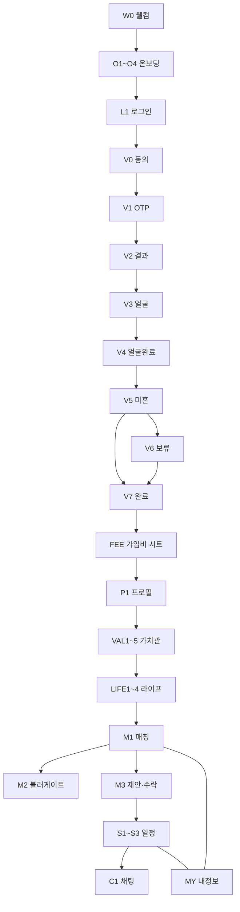

# 리봄 앱 — 와이어프레임 (모바일)

> **형식:** GitHub 문서 (클릭 앱 아님)  
> **느낌:** `/demo` 화면과 같은 구성 · 큰 글씨 · 하단 CTA · 진행 도트  
> **기기:** 세로 모바일만 (기준 **9:16**, 데모와 동일 `720×1280` 논리 프레임)  
> **규칙 원본:** [FLOWCHART.md](./FLOWCHART.md) · [FRAMEWORK.md](./FRAMEWORK.md)  
> **제외:** Admin 운영 화면 (유저 플로우 다음 라운드) · 고해상도 시안

읽는 법: 각 화면의 **상자 그림 = 배치**, 표 = **요소·동작**.  
색/카피는 데모와 같게 가도 되고, 구현 시 카피만 미세 조정.

---

## 공통 레이아웃

```text
┌─────────────────────────┐  ← 상태바 (시스템)
│  [선택] 건너뛰기 / 뒤로   │  ← 상단 유틸 (화면별)
│                         │
│      본문 스크롤 영역      │
│                         │
│  ·····················  │
│                         │
│  ○ ○ ● ○   진행 도트     │  ← 다단계일 때
│  ┌───────────────────┐  │
│  │   하단 고정 CTA    │  │
│  └───────────────────┘  │
└─────────────────────────┘
```

**메인 탭 이후**에는 하단 네비 고정:

```text
│  [♥ 매칭]  [📅 일정]  [👤 프로필]  │
```

| 토큰 (데모 기준) | 용도 |
|------------------|------|
| `bg-background` (#faf8f4 계열) | 화면 바탕 |
| `text-primary` / `primary-light` | 제목·강조·배너 |
| `Button` fullWidth · 큰 글씨 | 하단 CTA |
| 카드 = 흰 배경 + border | 프로필·제안 카드만 (히어로에 카드 남용 금지) |

---

## 화면 지도



---

## W0 — 웰컴 `/welcome`

```text
┌─────────────────────────┐
│                         │
│         (로고)           │
│                         │
│     다시, 봄이 옵니다      │
│         RE:BOM          │
│   50대 이상 프리미엄 …    │
│                         │
│                         │
│    [ 시작하기 ]          │
└─────────────────────────┘
```

| 요소 | 동작 |
|------|------|
| 시작하기 | → 온보딩 |

**데모 참고:** `OnboardingSlides` 슬라이드 0 분위기

---

## O1~O4 — 온보딩 `/onboarding`

공통: 상단 **건너뛰기** · 하단 **진행 도트 4개** · (마지막만) CTA

| # | 중심 카피(데모) | CTA |
|---|-----------------|-----|
| O1 | 로고 + 다시 봄이 옵니다 | 탭/스와이프 다음 |
| O2 | 검증된 분만 / 3단계 본인 인증 | 다음 |
| O3 | 프라이버시 · 가치관 | 다음 |
| O4 | 시작 유도 | **시작하기** → 로그인 / **이미 회원** → 로그인 |

```text
┌─────────────────────────┐
│              건너뛰기    │
│                         │
│       (아이콘/로고)       │
│      큰 제목 2줄         │
│      설명 1~2줄          │
│                         │
│         ○ ○ ● ○         │
│    [ 시작하기 ]  (O4만)   │
│     이미 회원이신가요?    │
└─────────────────────────┘
```

**데모 참고:** `OnboardingSlides`

---

## L1 — 로그인

```text
┌─────────────────────────┐
│  ←                     │
│       로그인            │
│                         │
│  [ 카카오로 계속하기 ]   │
│  [ 구글로 계속하기 ]     │
│  [ 휴대폰 번호로 로그인 ] │
│                         │
│   가입 = 위 수단과 동일   │
└─────────────────────────┘
```

| 요소 | 동작 |
|------|------|
| 카카오/구글 | 소셜 인증 → 신원검증(미완 시) 또는 메인 |
| 휴대폰 | 번호+OTP 로그인 플로우 |

성공 후 **강제 리다이렉트 없음**. 미완 단계는 해당 기능만 막음.

---

## V0 — 동의 (신원검증 시작)

```text
┌─────────────────────────┐
│  본인인증을 시작합니다    │
│  안내에 동의해 주세요     │
│                         │
│  ☑ 이용약관 (필수)       │
│  ☑ 개인정보 (필수)       │
│  ☑ 제3자 제공 (필수)     │
│  ☑ 만 50세 이상 (필수)   │
│  ☐ SMS 마케팅 (선택)     │
│                         │
│  ○ ○ ○ ○ ○ ○ ○ ○       │
│  [ 본인인증 하기 ]       │
└─────────────────────────┘
```

| 규칙 | |
|------|--|
| CTA | 필수 4개 전부면 활성 |
| 다음 | V1 |

**데모 참고:** `VerificationSlides` step 0 · `DemoConsentChecklist`

---

## V1 — 휴대폰 OTP

```text
┌─────────────────────────┐
│  STEP 1                 │
│  휴대폰 인증             │
│                         │
│  휴대폰 번호  [________] │
│  [ 인증번호 받기 ]       │
│  인증번호    [______]    │
│                         │
│  ○ ● ○ ○ ○ ○ ○ ○       │
│  [ 확인 ]               │
└─────────────────────────┘
```

성공 시 **이름·성별·나이·국적** 확보 → V2

---

## V2 — 휴대폰 결과

```text
┌─────────────────────────┐
│  STEP 2                 │
│  인증 정보 확인          │
│                         │
│  이름    홍길동          │
│  성별    여              │
│  나이    58세            │
│  국적    대한민국        │
│                         │
│  ○ ○ ● ○ ○ ○ ○ ○       │
│  [ 다음 ]               │
└─────────────────────────┘
```

실데이터 표시 (하드코딩 금지)

---

## V3~V4 — 얼굴

**V3 촬영**

```text
┌─────────────────────────┐
│  STEP 3  얼굴 인증       │
│                         │
│     ┌───────────┐       │
│     │  카메라   │       │
│     │  가이드   │       │
│     └───────────┘       │
│   얼굴을 맞춰 주세요     │
│                         │
│  [ 촬영하기 ]            │
└─────────────────────────┘
```

**V4 완료** — 체크 아이콘 + “얼굴 인증 완료” + [다음] → V5

---

## V5 / V6 / V7 — 미혼 · 보류 · 완료

**V5 미혼 폼**

```text
┌─────────────────────────┐
│  STEP 5  미혼 인증       │
│                         │
│  실명   [________]       │
│  생년월일 YYMMDD         │
│                         │
│  [ 미혼 인증하기 ]       │
│  [ 나중에 하기 ]         │
└─────────────────────────┘
```

| 결과 | 화면 |
|------|------|
| 승인 | V7 (3/3 완료 톤) |
| 현재 혼인 | **가입 불가** 풀스크린 안내 (앱 이용 중단) |
| 나중에 | V6 보류 안내 → V7 (2/3 · 매칭 잠금 안내) |

**V6**

```text
│  미혼 인증을 나중에 할 수 있습니다 │
│  매칭은 인증 후 이용 가능합니다   │
│  [ 확인 ] → V7 / 프로필          │
```

**V7 완료** — 성공 패널 + [서비스 둘러보기] → 가입비 시트(A/B…) 또는 프로필

**데모 참고:** `VerificationSlides` · `DemoMaritalVerificationScreen`

---

## FEE — 가입비 10만 (시트/모달)

A 로그인 후 · B 미혼 후 · C 큐레이션 후 · D 매칭 탭 — **같은 UI 재사용**

```text
┌─────────────────────────┐
│      가입비 안내         │
│                         │
│      100,000원          │
│   매칭 이용에 필요합니다  │
│                         │
│  [ 결제하기 ]            │
│  [ 나중에 ]  ← 스킵      │
└─────────────────────────┘
```

D에서 미결제 + 매칭 진입 → **M2 블러** (나중에만 반복 노출)

---

## P1 — 프로필 `/profile`

```text
┌─────────────────────────┐
│  기본 프로필             │
│                         │
│  [+][+][+]  사진 *필수   │
│  닉네임  [________] *    │
│  성별    (자동·잠금)     │
│  나이    (자동·잠금)     │
│  지역    [수도권 ▼] *    │
│  소개    [________]      │
│                         │
│  [ 다음 ] → 가치관       │
└─────────────────────────┘
```

지역: 서울·경기·인천 등 수도권

---

## VAL1~5 — 가치관 `/values`

칩 그리드 · 단계당 최소 1개 · 하단 도트 5 · [다음]

| # | 제목 |
|---|------|
| 1 | 만남 우선순위 |
| 2 | 관계 목표 |
| 3 | 정치 |
| 4 | 종교 |
| 5 | 피하고 싶은 것 → 저장 후 라이프 |

```text
┌─────────────────────────┐
│  Q2 / 5  관계 목표       │
│                         │
│  [칩] [칩] [칩]          │
│  [칩] [칩] [칩]          │
│                         │
│  ○ ● ○ ○ ○             │
│  [ 다음 ]               │
└─────────────────────────┘
```

**데모 참고:** `ProfileCurationSlides` / `ValuesCurationForm`

---

## LIFE1~4 — 라이프 `/lifestyle`

| # | 내용 |
|---|------|
| 1 | 활동 |
| 2 | 가족 |
| 3 | 자기관리 |
| 4 | 음주 + 흡연 (한 화면, 둘 다 필수) → 메인 |

레이아웃은 가치관과 동일(칩 + 도트 + CTA).

**데모 참고:** `LifestyleCurationSlides`

---

## M1 — 매칭 탭 `/matches` (제안 있음)

> 프레임워크: **운영 매칭 제안 1건 · 2일 갱신** (구 “오늘의 추천 1명/일·관심” 아님)

```text
┌─────────────────────────┐
│  매칭                    │
│  매칭 제안 · 48시간 남음  │
│                         │
│  ┌───────────────────┐  │
│  │     (사진)         │  │
│  │  닉네임 · 나이      │  │
│  │  지역 · 짧은 소개   │  │
│  │  가치관 태그 …      │  │
│  │                   │  │
│  │ [ 수락하기 ]       │  │
│  │ [ 거절하기 ]       │  │
│  └───────────────────┘  │
│                         │
│  [매칭] [일정] [프로필]  │
└─────────────────────────┘
```

| 액션 | 다음 |
|------|------|
| 수락 | 결제창(매칭비 3만 / 첫 1회 0원) → 성공 시 “상대 결제 대기” 또는 성사 |
| 거절 | 확인 다이얼로그 → 취소(상대엔 미납 취소 문구) |
| 제안 없음 | 빈 상태: “다음 제안은 2일 주기입니다” |

**데모 참고 레이아웃:** `DemoVerifiedMatchingScreen` (카피·버튼은 프레임워크에 맞게 수락/거절로 교체)

---

## M2 — 매칭 블러 (미혼 미완 / 가입비 미납)

```text
┌─────────────────────────┐
│  (뒤: 카드 흐림 blur)     │
│                         │
│   ┌─────────────────┐   │
│   │ 인증/결제가       │   │
│   │ 필요합니다        │   │
│   │ [ 인증하기 ]      │   │
│   │ [ 가입비 결제 ]   │   │
│   └─────────────────┘   │
│  [매칭] [일정] [프로필]  │
└─────────────────────────┘
```

타인 신상 판독 불가. **데모 참고:** `DemoHomeScreen` 블러+오버레이

---

## M3 — 결제 · 대기 · 성사

**결제 시트**

```text
│  매칭비 30,000원 (또는 첫 회 무료) │
│  [ 결제하기 ]  [ 취소 ]           │
```

**대기**

```text
│  상대측 결제 대기중               │
│  48시간 타이머 표시               │
```

**성사 토스트/화면** → “일정 탭에서 조율하세요” · 일정 탭 배지

---

## S1 — 일정 탭 (성사 후) `/schedule`

```text
┌─────────────────────────┐
│  만남 일정               │
│  리봄이 일정과 장소를 …  │
│                         │
│  상대: 닉네임            │
│                         │
│  ① 불가능 시간 선택 *    │
│     (앞으로 10일 달력)   │
│  ② 가능 장소 *           │
│  ③ 메모 (선택)           │
│  [ 제출하기 ]            │
│                         │
│  — 제출 후 —             │
│  상태: 리봄 조율 중 …    │
│  [매칭] [일정] [프로필]  │
└─────────────────────────┘
```

**데모 참고:** `DemoScheduleScreen` · `ScheduleCoordinationView` (타임라인 UX를 **불가능 시간 입력 → 운영 제안 → 수락** 순으로 재배치)

---

## S2 — 운영 일정 제안 (유저 수신)

```text
│  일정 제안이 도착했습니다 │
│  날짜 · 시간 · 장소      │
│  [ 수락 ]  [ 조율 요청 ] │
│  ※ 추가 결제 없음        │
```

양쪽 수락 → S3 확정

---

## S3 — 일정 확정

```text
│  ✓ 만남이 확정되었습니다  │
│  날짜·시간·장소          │
│  채팅은 만남 24시간 전    │
│  [ 채팅으로 이동 ] (열릴 때만 활성) │
```

번호 **비공개**. 만남 시 연락처 교환 안내 문구 상시/채팅에 노출

---

## C1 — 채팅

```text
┌─────────────────────────┐
│  ←  닉네임               │
│  만남까지 23:10:05       │
│  ※ 만남에서 연락처 교환   │
│─────────────────────────│
│  (말풍선들)              │
│                         │
│─────────────────────────│
│  [메시지 입력…    ] [전송]│
└─────────────────────────┘
```

| 상태 | UI |
|------|-----|
| 오픈 전 | 잠금 화면: “만남 24시간 전에 열립니다” |
| 오픈~만남+24h | 송수신 가능 |
| 종료 후 | 읽기 전용 또는 종료 안내 |

하단 탭 **없음**(풀스크린) 또는 일정에서 진입 후 뒤로 = 일정

---

## MY — 내 정보 `/my`

```text
┌─────────────────────────┐
│  (사진) 닉네임 · 나이    │
│  지역 · 태그             │
│                         │
│  [ 프로필 수정 ]         │
│  [ 가치관 수정 ]         │
│  [ 라이프 수정 ]         │
│  [ 미혼 인증하기 ] *     │
│  [ 학력 인증 ]           │
│  [ 직업/소득 인증 ]      │
│  [ 결제 내역 ]           │
│  [ 로그아웃 ]             │
│  [매칭] [일정] [프로필]  │
└─────────────────────────┘
```

**학력 서브**

```text
│  ○ 초 ○ 중 ○ 고 ○ 대    │
│  학교명 (선택) [____]    │
│  ⚠ 허위 시 법적 책임 본인 │
│  [ 저장 ]               │
```

**직업 서브**

```text
│  서류 업로드 (주민번호 뒷자리 금지) │
│  [+] 재산세 / 급여 / 전직장 …     │
│  상태: 심사중 / 승인 / 반려       │
```

---

## 빈·에러·다이얼로그 (공통)

| 상황 | UI |
|------|-----|
| 매칭 제안 없음 | 빈 일러스트 + 안내 문장 |
| 일정 미성사 | “매칭이 성사되면 일정이 열립니다” |
| 관심/수락 취소·거절 | 확인 모달 1회 |
| 결제 실패 | 토스트 + 시트 유지 |
| 48h 만료 | 취소 안내 (미납 문구 정책) |
| 현재 혼인 | 전면 차단 화면 |

---

## 구현 체크리스트 (유저 플로우)

- [ ] W0 웰컴
- [ ] O1~O4 온보딩
- [ ] L1 로그인 3수단
- [ ] V0~V7 신원검증 (+ 혼인 차단)
- [ ] FEE 가입비 시트 A~D
- [ ] P1 프로필
- [ ] VAL1~5 · LIFE1~4
- [ ] M1 제안 카드 · M2 블러 · M3 결제/대기
- [ ] S1~S3 일정
- [ ] C1 채팅 시간창
- [ ] MY (+ 학력·직업 서브)

---

## 다음 라운드 (이번 문서 제외)

- Admin 와이어 (짝 짓기 · 일정 제안 · 서류 심사)
- 고해상도 시각 시안 / Figma

---

문의: primesenior0530@gmail.com  
**버전:** 2026-07-11
