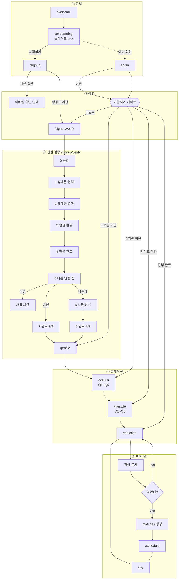
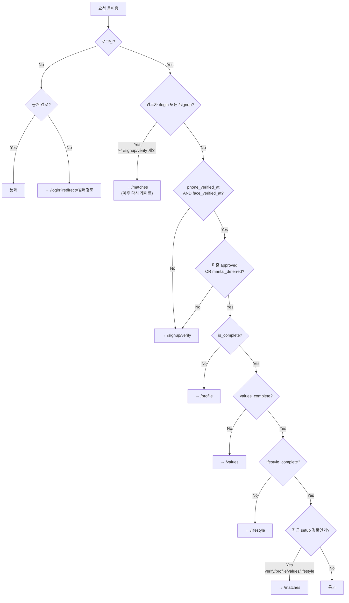
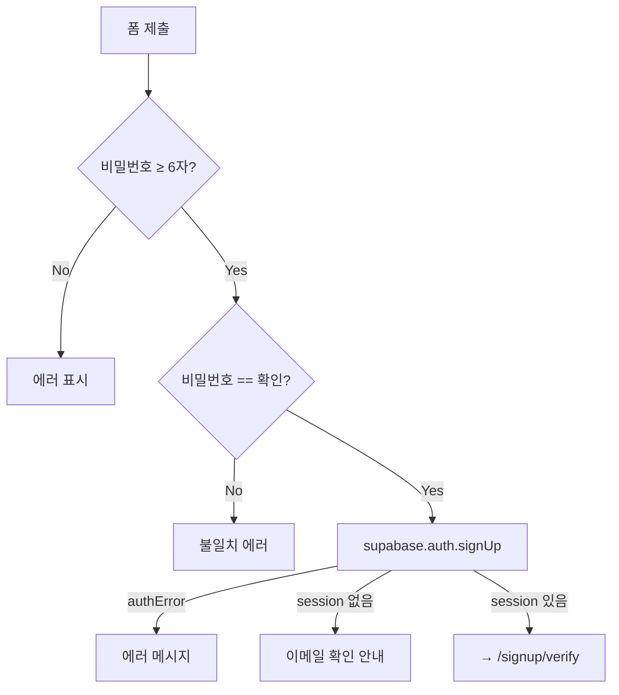
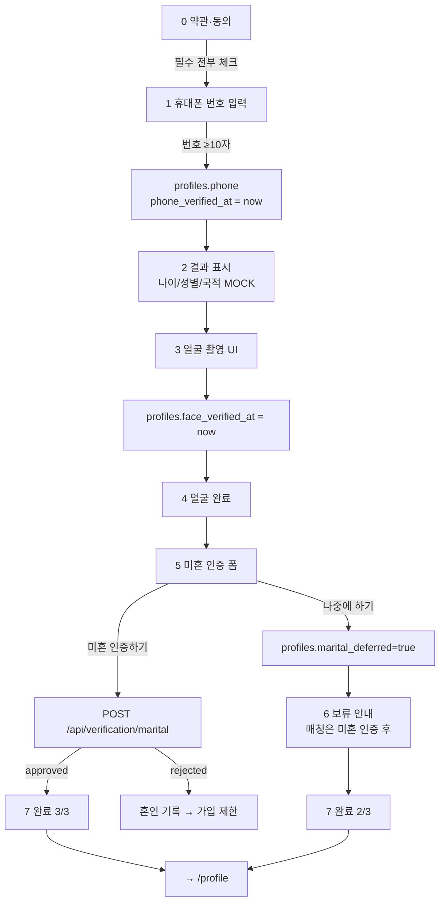
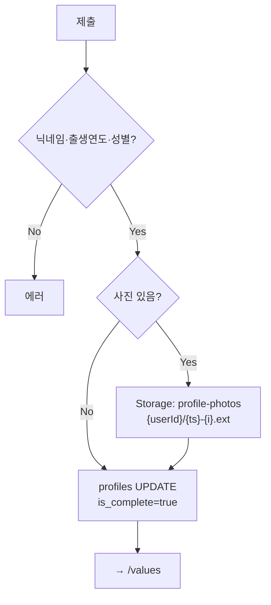
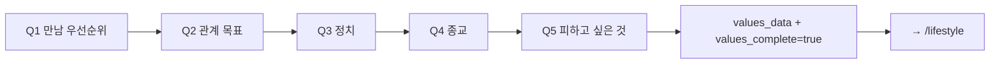
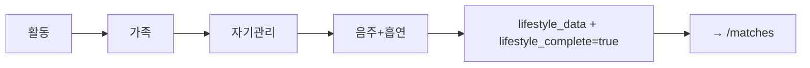
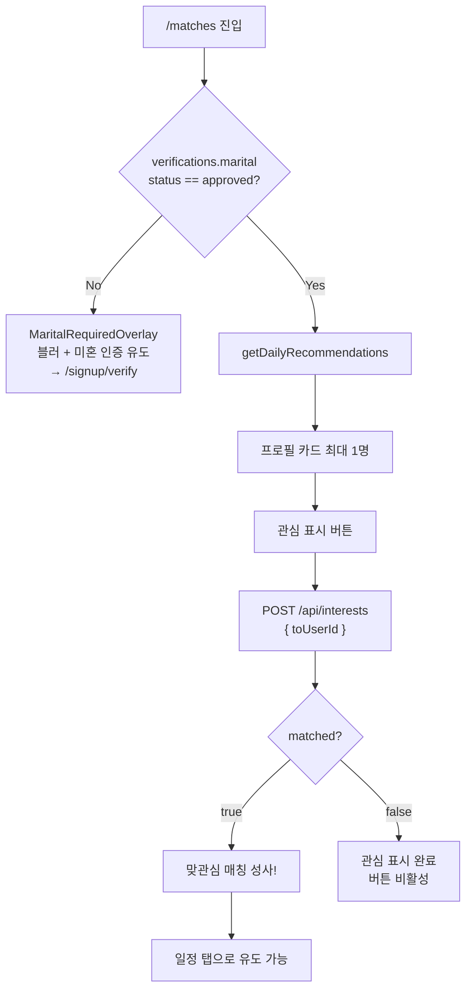
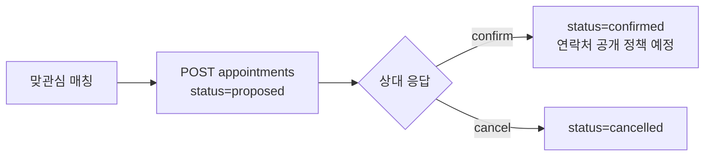
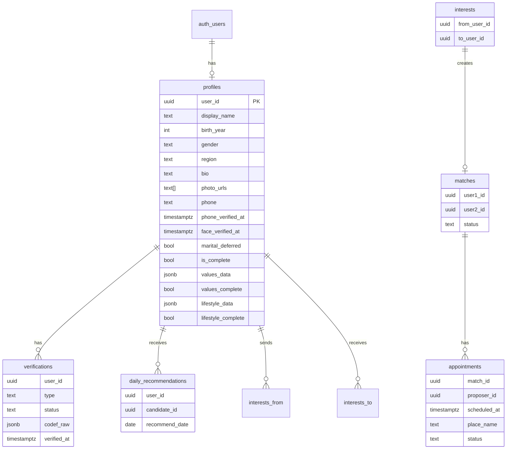

# 리봄 앱 — 상세 플로우차트 (개발자 전달용)

> **범위:** 앱만 (랜딩·사전예약 웹 제외)  
> **기준:** 현재 구현된 MVP 코드  
> **목적:** 화면 → 입력 → 검증 → API → DB → 다음 화면을 빠짐없이 전달

---

## 0. 한 줄 요약

```
웰컴 → 온보딩 → 가입/로그인
  → 동의 → 휴대폰 → 얼굴 → 미혼(또는 보류)
  → 프로필 → 가치관(5문항) → 라이프스타일(5문항)
  → 매칭(오늘의 추천 1명) → 관심 → 맞관심 시 매칭
  → 일정 제안/수락/확정
```

**없는 기능:** 채팅, 스와이프, 결제/구독, 학력·직업 실인증

---

## 1. 전체 마스터 플로우



---

## 2. 미들웨어 게이트 (강제 순서)

**파일:** `middleware.ts`  
로그인된 사용자는 아래를 **순서대로** 통과해야 메인 탭 사용 가능.



### 공개 경로 (로그인 없이 가능)

| 경로 | 비고 |
|------|------|
| `/welcome` | 앱 첫 화면 |
| `/onboarding` | 온보딩 |
| `/login` | 로그인 |
| `/signup` | 가입 (`/signup/*` 포함 → verify는 로그인 후) |
| `/demo/*` | 데모·녹화용 (게이트 우회) |

### 게이트가 보는 DB 필드

| 필드 | 테이블 | 의미 |
|------|--------|------|
| `phone_verified_at` | profiles | 휴대폰 인증 시각 |
| `face_verified_at` | profiles | 얼굴 인증 시각 |
| `marital_deferred` | profiles | 미혼 인증 나중에 하기 |
| `verifications.status` | verifications (`type=marital`) | `approved`면 미혼 통과 |
| `is_complete` | profiles | 기본 프로필 완료 |
| `values_complete` | profiles | 가치관 완료 |
| `lifestyle_complete` | profiles | 라이프스타일 완료 |

---

## 3. 화면별 상세 스펙

### 3-1. `/welcome` — 웰컴

| 항목 | 내용 |
|------|------|
| 역할 | 앱 첫 진입 |
| CTA | 시작 → `/onboarding` |
| 로그인 | 불필요 |

---

### 3-2. `/onboarding` — 온보딩 슬라이드 (4장)

| 슬라이드 | 내용 |
|----------|------|
| 0 | 로고 + "다시, 봄이 옵니다" + 50대 이상 프리미엄 |
| 1 | 검증 소개 |
| 2 | 프라이버시 / 가치관 |
| 3 | 시작하기 CTA |

| 항목 | 내용 |
|------|------|
| 조작 | 탭/스와이프로 다음, 우측 상단 **건너뛰기** |
| CTA | 시작하기 → `/signup` |
| 컴포넌트 | `OnboardingFlow` → `OnboardingSlides` |

---

### 3-3. `/signup` — 회원가입



| 필드 | 필수 | 규칙 |
|------|------|------|
| 이메일 | ✅ | email |
| 비밀번호 | ✅ | 6자 이상 |
| 비밀번호 확인 | ✅ | 비밀번호와 동일 |

| 저장 | Supabase Auth `auth.users` |
| 다음 | `/signup/verify` |
| 링크 | 이미 계정 있음 → `/login` |

---

### 3-4. `/login` — 로그인

| 필드 | 필수 |
|------|------|
| 이메일 | ✅ |
| 비밀번호 | ✅ |

| 성공 후 | 미들웨어가 미완료 단계로 리다이렉트 (verify → profile → values → lifestyle → matches) |
| 실패 | `formatAuthError`로 한글 에러 |

---

### 3-5. `/signup/verify` — 신원 검증 (스텝 0~7)

**컴포넌트:** `VerificationFlow`  
**진행 표시:** 하단 도트 8개 (`STEP_COUNT = 8`)



#### STEP 0 — 동의

| id | 필수 | 라벨 |
|----|------|------|
| `terms` | ✅ | 이용약관 |
| `privacy` | ✅ | 개인정보 수집·이용 |
| `third-party` | ✅ | 제3자 제공 |
| `age` | ✅ | 만 50세 이상 |
| `marketing` | ❌ | SMS 마케팅 |

- 필수 전부 체크해야 CTA 활성
- CTA: "본인인증 하기" → step 1

#### STEP 1 — 휴대폰

| 입력 | 규칙 |
|------|------|
| 휴대폰 번호 | trim 후 길이 ≥ 10 |

| DB 저장 | `profiles.phone`, `profiles.phone_verified_at` |
| MVP 메모 | 실제 SMS OTP 없음 — 번호 입력 후 바로 통과 |

#### STEP 2 — 휴대폰 결과 (표시만)

| 표시 | 현재 하드코딩 |
|------|----------------|
| 나이 | `58세` |
| 성별 | `남성` |
| 국적 | `대한민국` |

#### STEP 3~4 — 얼굴

| 동작 | `face_verified_at` 저장 후 완료 화면 |
| MVP | 실제 카메라/얼굴인식 API 없음 — 버튼 누르면 통과 |

#### STEP 5 — 미혼 인증

| 입력 | 필수 | 규칙 |
|------|------|------|
| 실명 | ✅ | 있음 |
| 생년월일 | ✅ | 숫자 6자리 `YYMMDD` |
| 성별 | ❌ | male / female / 빈값 |

**API:** `POST /api/verification/marital`

```json
// Request
{ "name": "홍길동", "birthDate": "650315", "gender": "male" }

// Response 성공
{ "approved": true, "message": "..." }

// Response 거절
{ "approved": false, "message": "혼인 기록이 확인되어..." }
```

**DB:** `verifications` upsert

| 컬럼 | 값 |
|------|-----|
| `user_id` | 현재 유저 |
| `type` | `marital` |
| `status` | `approved` \| `rejected` |
| `codef_raw` | Codef/MOCK 원본 |
| `verified_at` | 승인 시 ISO 시각 |

**외부:** `lib/codef.ts` — Codef 샌드박스. `MOCK_VERIFICATION=true`면 MOCK 통과.

**나중에 하기:** `profiles.marital_deferred = true` → step 6 → step 7 (2/3 완료)

#### STEP 7 — 완료

| 상태 | 표시 | CTA |
|------|------|-----|
| 미혼 완료 | 3 OF 3 COMPLETE | 서비스 둘러보기 → `/profile` |
| 미혼 보류 | 2 OF 3 COMPLETE | 동일 → `/profile` |

**중요:** 미혼 보류해도 프로필·가치관·라이프까지는 갈 수 있음.  
**매칭 추천은 미혼 `approved`일 때만** (`/matches`에서 오버레이).

---

### 3-6. `/profile` — 기본 프로필



| 필드 | 필수 | 규칙 |
|------|------|------|
| 사진 | ❌ | jpeg/png/webp, 최대 3장 |
| 닉네임 | ✅ | trim, 비어 있으면 안 됨 |
| 출생연도 | ✅ | 현재−50년 ~ 현재−99년 옵션 |
| 성별 | ✅ | male / female |
| 지역 | ✅ | 현재 옵션: **`서울 강남`만** (`lib/regions.ts`) |
| 자기소개 | ❌ | bio |
| 휴대폰 | ❌ | 추가 입력 가능 (검증 때 넣은 번호와 별도 필드 재입력 UI 있음) |

| DB | `display_name, birth_year, gender, region, bio, phone, photo_urls, is_complete=true` |
| Storage | 버킷 `profile-photos` |
| 다음 | `/values` |

---

### 3-7. `/values` — 가치관 큐레이션 (5단계)

**컴포넌트:** `ValuesCurationForm`  
각 단계 **최소 1개** 칩 선택해야 다음 (avoid는 선택 가능·빈값 허용)



| 단계 | DB 키 | 칩 옵션 |
|------|-------|---------|
| Q1 | `meeting_priorities` | 진솔한 대화 / 서로 존중 / 천천히 알아가기 / 가족·인연 중시 / 함께 성장 |
| Q2 | `relationship_goals` | 결혼이 목표에요 / 진지한 만남 / 친구같은 만남 / 상황에 따라 / 반드시 결혼은 아님 / 가벼운 관계는 싫어요 |
| Q3 | `politics` | 보수 / 진보 / 중도·실용 / 관심 없어요 / 대화 시 존중 |
| Q4 | `religion` | 기독교 / 천주교 / 불교 / 무교 / 관심 없어요 / 대화 시 존중 |
| Q5 | `avoid_filters` | 과한 음주 / 흡연 / 운동 부족 / 대머리 / 과체중 / 과한 탈모 / 결혼이 목적인 사람 |

| 저장 | `profiles.values_data` (JSON), `values_complete=true` |
| 다음 | `/lifestyle` |

---

### 3-8. `/lifestyle` — 라이프스타일 큐레이션 (5단계)

**컴포넌트:** `LifestyleCurationForm`  
각 단계 최소 1개 (음주·흡연 화면은 **둘 다** 1개 이상)



| 단계 | DB 키 | 칩 옵션 |
|------|-------|---------|
| 활동 | `activities` | 산책·등산 / 요리·맛집 / 여행 / 독서·영화 / 음악·공연 |
| 가족 | `family` | 자녀 없음 / 자녀와 동거 / 자녀 독립 / 반려동물 / 부모님과 동거 |
| 자기관리 | `self_care` | 헬스 / 요가·필라테스 / 독서 / 외국어 / 투자 / 산책·러닝 |
| 음주 | `drinking` | 안 마셔요 / 가끔 / 주1~2 / 주3~4 / 거의 매일 |
| 흡연 | `smoking` | 안 해요 / 가끔 / 반갑 이하 / 1갑 / 1갑 이상 |

| 저장 | `profiles.lifestyle_data` (JSON), `lifestyle_complete=true` |
| 다음 | `/matches` |

---

## 4. 메인 탭 상세

하단 네비 (`BottomNav`): **매칭** `/matches` · **일정** `/schedule` · **프로필** `/my`

---

### 4-1. `/matches` — 매칭 (오늘의 추천)



#### 추천 알고리즘 (`lib/recommendations.ts`)

1. 오늘 날짜로 `daily_recommendations`에 이미 있으면 그 후보 사용  
2. 없으면 후보 선정:
   - `profiles.is_complete = true`
   - **같은 `region`**
   - 본인 제외
   - 이미 관심 보낸 사람 제외
   - 후보의 미혼 인증 `approved`
3. **하루 1명**만 `daily_recommendations`에 upsert  
4. 반환 프로필 최대 1명

#### 관심 → 매칭 (`POST /api/interests`)

| 단계 | 동작 |
|------|------|
| 1 | `interests` insert (`from_user_id`, `to_user_id`) |
| 2 | 이미 있으면(23505) → `{ matched: false, message: "이미 관심을..." }` |
| 3 | 상대가 나에게도 관심 있는지 조회 |
| 4 | 맞관심이면 `matches` upsert (`user1_id < user2_id` 정렬, `status=active`) |
| 5 | 응답 `{ matched: true/false, message }` |

---

### 4-2. `/schedule` — 일정

**현재 UI:** `ScheduleCoordinationView` — 조율 타임라인 UX (데모성 고정 데이터 포함)

타임라인 단계:

| 순서 | 제목 | 상태 예 |
|------|------|---------|
| 1 | 가능 시간 전달 | done |
| 2 | 리봄 조율 | done |
| 3 | 일정·장소 제안 | current |
| 4 | 일정 확정 | upcoming |
| 5 | 만남 당일 | locked |

#### 일정 API (백엔드 구현됨)

**조회** `GET /api/appointments`  
→ 내 active 매칭의 `proposed` / `confirmed` 일정 + 상대 프로필

**제안** `POST /api/appointments`

```json
{
  "matchId": "uuid",
  "scheduledAt": "ISO datetime",
  "placeName": "경희다이닝 강남역점",
  "placeAddress": "선택",
  "note": "선택"
}
```

→ `appointments` insert, `status=proposed`, `proposer_id=나`

**수락/취소** `PATCH /api/appointments/[id]`

```json
{ "action": "confirm" }  // → confirmed
{ "action": "cancel" }   // → cancelled
```

- 매칭 참여자만 가능
- `proposed` 상태만 변경 가능



> **구현 갭:** UI 타임라인은 조율 UX를 보여 주지만, 폼↔API 완전 연결은 `AppointmentForm` 등 일부와 병행. 개발 시 API 스펙 위 기준으로 맞추면 됨.

---

### 4-3. `/my` — 내 프로필

| 표시 | 사진, 닉네임, 나이(출생연도 계산), 지역, 가치관·라이프 태그 |
|------|------|
| 인증 버튼 | 미혼상태 인증하기 → `/signup/verify` (필수) |
| | 학력인증하기 — **UI만, 미구현** |
| | 직업/소득 인증하기 — **UI만, 미구현** |
| 수정 | 가치관 → `/values`, 라이프 → `/lifestyle` |
| 기타 | 로그아웃 |

---

## 5. DB 테이블 관계



---

## 6. API 목록 (앱)

| Method | Path | 용도 | 인증 |
|--------|------|------|------|
| POST | `/api/verification/marital` | 미혼 인증 | ✅ |
| GET | `/api/recommendations` | 추천 조회 | ✅ |
| POST | `/api/interests` | 관심 표시 | ✅ |
| GET | `/api/matches` | 매칭 목록 | ✅ |
| GET | `/api/appointments` | 일정 목록 | ✅ |
| POST | `/api/appointments` | 일정 제안 | ✅ |
| PATCH | `/api/appointments/[id]` | 수락/취소 | ✅ |

---

## 7. 예외·엣지 케이스

| 상황 | 동작 |
|------|------|
| 가입 후 세션 없음 (이메일 확인 ON) | 가입 화면에서 안내. MVP는 Confirm email OFF 권장 |
| 미혼 인증 거절 | 에러 메시지, 가입 제한 |
| 미혼 나중에 하기 | 프로필까지 진행 가능, 매칭은 블러 |
| 이미 관심 표시 | 에러 대신 `matched:false` + 안내 |
| 오늘 추천 후보 없음 | 빈 카드 / 추천 없음 |
| 다른 지역 유저 | 추천 안 됨 (현재 지역 `서울 강남`만) |
| setup 완료 후 `/profile` 재진입 | 미들웨어가 `/matches`로 보냄 |
| `/demo/*` | 게이트 우회 (실서비스 아님) |

---

## 8. MVP에서 가짜(MOCK)인 것

| 기능 | 현재 상태 |
|------|-----------|
| 휴대폰 OTP | 번호만 저장, 바로 통과 |
| 얼굴 인식 | 버튼만, 바로 통과 |
| 미혼 인증 | Codef 없으면 `MOCK_VERIFICATION=true`로 통과 |
| 휴대폰 결과 나이/성별 | 하드코딩 표시 |
| 학력·직업 인증 | 버튼만 존재 |
| 일정 조율 UI | 타임라인 데모 데이터 포함 가능 |

---

## 9. 환경변수 (앱 관련)

```
NEXT_PUBLIC_SUPABASE_URL=
NEXT_PUBLIC_SUPABASE_ANON_KEY=
SUPABASE_SERVICE_ROLE_KEY=
CODEF_CLIENT_ID=          # 선택
CODEF_CLIENT_SECRET=      # 선택
CODEF_PUBLIC_KEY=         # 선택
MOCK_VERIFICATION=true    # Codef 없을 때
```

---

## 10. 화면 경로 체크리스트

- [ ] `/welcome`
- [ ] `/onboarding` (4슬라이드)
- [ ] `/signup` / `/login`
- [ ] `/signup/verify` (0~7)
- [ ] `/profile`
- [ ] `/values` (5문항)
- [ ] `/lifestyle` (5문항)
- [ ] `/matches` (+ 미혼 미완료 오버레이)
- [ ] `/schedule`
- [ ] `/my`

---

문의: primesenior0530@gmail.com
